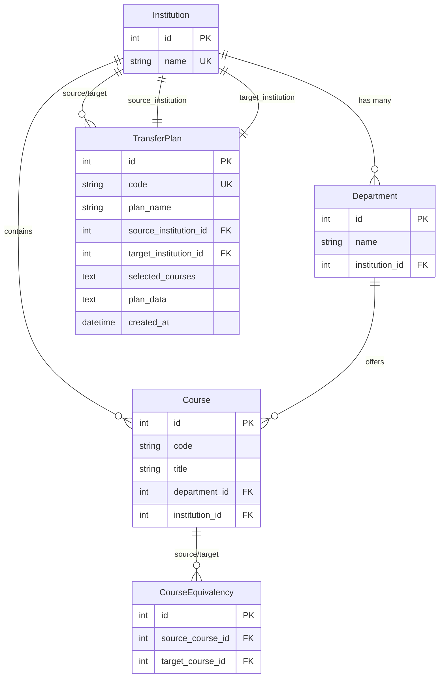

# Course Equivalency Database Design

## **Database Overview**

The database follows a **normalized relational design** using SQLite with a hierarchical structure. This was chosen to maintain data integrity while mimicking the real world structure of an educational organization.
```
Institution (1) ──── (M) Department (1) ──── (M) Course
     │                                            │
     │                                            │
     └─── TransferPlan (M) ────────────── (M) ───┘
              │
              │
     CourseEquivalency (M:M relationship table)
```

## **ERD**



## **Tables **

### **1. Institution Table**
```sql
CREATE TABLE Institution (
    id INTEGER PRIMARY KEY AUTOINCREMENT,
    name TEXT UNIQUE NOT NULL
);
```

**Purpose**: Root entity representing educational institutions  
**Examples**: "Delgado Community College", "University of New Orleans"

| Column | Type | Constraints | Description |
|--------|------|-------------|-------------|
| `id` | INTEGER | PRIMARY KEY, AUTOINCREMENT | Unique institution identifier |
| `name` | TEXT | UNIQUE, NOT NULL | Full institution name |

**Business Rules**:
- Each institution must have a unique name
- Institution names are used for display and CSV import matching

---

### **2. Department Table**
```sql
CREATE TABLE Department (
    id INTEGER PRIMARY KEY AUTOINCREMENT,
    name TEXT NOT NULL,
    institution_id INTEGER NOT NULL,
    FOREIGN KEY (institution_id) REFERENCES Institution (id),
    UNIQUE(name, institution_id)
);
```

**Purpose**: Academic departments within institutions  
**Examples**: "Computer Science", "Mathematics", "English"

| Column | Type | Constraints | Description |
|--------|------|-------------|-------------|
| `id` | INTEGER | PRIMARY KEY, AUTOINCREMENT | Unique department identifier |
| `name` | TEXT | NOT NULL | Department name |
| `institution_id` | INTEGER | FOREIGN KEY, NOT NULL | Parent institution |

**Business Rules**:
- Department names must be unique within each institution
- Same department name can exist at different institutions
- Departments cannot exist without a parent institution

---

### **3. Course Table**
```sql
CREATE TABLE Course (
    id INTEGER PRIMARY KEY AUTOINCREMENT,
    code TEXT NOT NULL,
    title TEXT NOT NULL,
    department_id INTEGER NOT NULL,
    institution_id INTEGER NOT NULL,
    FOREIGN KEY (department_id) REFERENCES Department (id),
    FOREIGN KEY (institution_id) REFERENCES Institution (id),
    UNIQUE(code, department_id, institution_id)
);
```

**Purpose**: Individual courses offered by departments  
**Examples**: "MATH 130 - College Algebra", "ENGL 101 - English Composition I"

| Column | Type | Constraints | Description |
|--------|------|-------------|-------------|
| `id` | INTEGER | PRIMARY KEY, AUTOINCREMENT | Unique course identifier |
| `code` | TEXT | NOT NULL | Course code (e.g., "MATH 130") |
| `title` | TEXT | NOT NULL | Course title (e.g., "College Algebra") |
| `department_id` | INTEGER | FOREIGN KEY, NOT NULL | Parent department |
| `institution_id` | INTEGER | FOREIGN KEY, NOT NULL | Parent institution (denormalized for efficiency) |

**Business Rules**:
- Course codes must be unique within department and institution
- Same course code can exist at different institutions
- Courses belong to exactly one department and institution
- `institution_id` is denormalized for query performance

---

### **4. CourseEquivalency Table**
```sql
CREATE TABLE CourseEquivalency (
    id INTEGER PRIMARY KEY AUTOINCREMENT,
    source_course_id INTEGER NOT NULL,
    target_course_id INTEGER NOT NULL,
    FOREIGN KEY (source_course_id) REFERENCES Course (id),
    FOREIGN KEY (target_course_id) REFERENCES Course (id),
    UNIQUE(source_course_id, target_course_id)
);
```

**Purpose**: Many-to-many relationship table storing course equivalencies  
**Examples**: DCC "MATH 130" ↔ UNO "MATH 1125"

| Column | Type | Constraints | Description |
|--------|------|-------------|-------------|
| `id` | INTEGER | PRIMARY KEY, AUTOINCREMENT | Unique equivalency identifier |
| `source_course_id` | INTEGER | FOREIGN KEY, NOT NULL | Source course in equivalency |
| `target_course_id` | INTEGER | FOREIGN KEY, NOT NULL | Target course in equivalency |

**Business Rules**:
- Each equivalency pair must be unique
- Equivalencies are directional but queried bidirectionally
- Courses can have multiple equivalents at different institutions
- Self-referential equivalencies are prevented by application logic

---

### **5. TransferPlan Table**
```sql
CREATE TABLE TransferPlan (
    id INTEGER PRIMARY KEY AUTOINCREMENT,
    code TEXT UNIQUE NOT NULL,
    plan_name TEXT NOT NULL,
    source_institution_id INTEGER NOT NULL,
    target_institution_id INTEGER NOT NULL,
    selected_courses TEXT NOT NULL,
    plan_data TEXT NOT NULL,
    created_at DATETIME DEFAULT CURRENT_TIMESTAMP,
    FOREIGN KEY (source_institution_id) REFERENCES Institution (id),
    FOREIGN KEY (target_institution_id) REFERENCES Institution (id)
);
```

**Purpose**: User-created transfer plans with shareable codes  
**Examples**: Student's plan to transfer from DCC to UNO

| Column | Type | Constraints | Description |
|--------|------|-------------|-------------|
| `id` | INTEGER | PRIMARY KEY, AUTOINCREMENT | Unique plan identifier |
| `code` | TEXT | UNIQUE, NOT NULL | 8-character shareable code |
| `plan_name` | TEXT | NOT NULL | User-defined plan name |
| `source_institution_id` | INTEGER | FOREIGN KEY, NOT NULL | Institution transferring from |
| `target_institution_id` | INTEGER | FOREIGN KEY, NOT NULL | Institution transferring to |
| `selected_courses` | TEXT | NOT NULL | JSON array of course IDs |
| `plan_data` | TEXT | NOT NULL | Complete plan data as JSON |
| `created_at` | DATETIME | DEFAULT CURRENT_TIMESTAMP | Plan creation timestamp |

**Business Rules**:
- Plan codes must be globally unique across all plans
- Plans expire after 1 year (enforced by application)
- JSON fields allow flexible metadata storage
- Source and target institutions can be the same (internal transfers)

## **Relationships**

### **Hierarchical Relationships**
```
Institution (1:M) Department (1:M) Course
```
- **One institution** has **many departments**
- **One department** has **many courses**
- **Courses** belong to exactly **one department and institution**

### **Many-to-Many Relationships**
```
Course (M:M) CourseEquivalency (M:M) Course
```
- **Courses** can be equivalent to **multiple other courses**
- **Equivalencies** are stored once but queried bidirectionally
- **Junction table** `CourseEquivalency` manages the relationship

### **Plan Relationships**
```
TransferPlan (M:1) Institution (source)
TransferPlan (M:1) Institution (target)  
TransferPlan (M:M) Course (via JSON array)
```
- **Plans** reference **source and target institutions**
- **Plans** contain **multiple courses** (stored as JSON for flexibility)
- **Soft relationship** to courses allows plan persistence even if courses are deleted

## **Future Scalability**

### **Current Design Capacity**
| Entity | Possible Capacity | Bottleneck |
|--------|-------------------|------------|
| Institutions | ~1,000 | Name uniqueness |
| Departments | ~50,000 | Institution × Department combinations |
| Courses | ~5,000,000 | Department × Course combinations |
| Equivalencies | ~10,000,000 | Course pair combinations |
| Plans | ~1,000,000 | Code space (2.8 trillion theoretical) |

- These number are an educated guess based on LA having ~1000 degree-granting institutions in the region with ~50 departments and ~100 classes per department and so on...
### **THe Growth**
- **Linear growth**: Institutions, Departments
- **Quadratic growth**: Courses (institutions × departments × courses per dept)
- **Exponential potential**: Equivalencies (courses × equivalent courses)

## **Data Integrity**

### **Referential Integrity**
- **Foreign Key Constraints** data consistency
- **Cascade behavior** controlled by application (soft deletes)
- **Orphan prevention** through constraint enforcement

### **Unique Constraints**
```sql
-- Prevent duplicate items
UNIQUE(Institution.name)
UNIQUE(Department.name, Department.institution_id)
UNIQUE(Course.code, Course.department_id, Course.institution_id)
UNIQUE(CourseEquivalency.source_course_id, CourseEquivalency.target_course_id)

UNIQUE(TransferPlan.code)
```

### **Data Validation**
- **NOT NULL constraints** on essential fields
- **Application-level validation** for business rules
- **JSON schema validation** for flexible fields

##  **Storage Considerations**

### **Space Efficiency**
- **INTEGER PKs** for optimal join performance
- **TEXT fields** sized appropriately for content
- **JSON compression** for plan data storage

### **Backup Strategy**
```sql
-- Full database backup (SQLite)
.backup main backup.db

-- Table-specific exports for CSV migration
.mode csv
.output institutions.csv
SELECT * FROM Institution;
```

## **Migration & Evolution**

### **Backward Compatibility**
- **JSON fields** allow adding metadata without schema changes
- **Soft constraints** in application allow gradual rollouts
- **Export/Import** via CSV maintains portability

- AUTHOR: Mitchell Mennelle