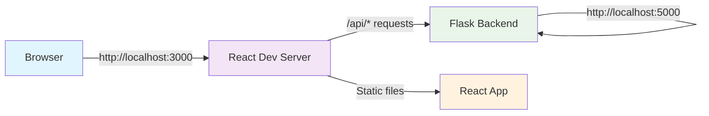

# React Development Proxy Architecture

## **System Overview**

This application will use a **proxy setup** where the React development server acts as a middleman between the frontend and the Flask backend. This is beneficial because it keeps separation between backend and frontend processes. One major benefit is "Hot Module Replacment" which is described below.



## **Configuration Breakdown**

### **1. package.json Proxy Setting**
```json
{
  "name": "frontend",
  "version": "0.1.0",
  "proxy": "http://localhost:5000",
  "dependencies": {
    "react": "^18.2.0",
    "react-scripts": "5.0.1"
  }
}
```

**What this does:**
- Tells React dev server to proxy **unrecognized requests** to `http://localhost:5000`
- Only applies to requests that **don't match static files**
- Automatically handles **CORS issues** in development

### **2. Request Flow Analysis**

#### **Static File Requests (Handled by React Dev Server)**
```
Browser Request: http://localhost:3000/
React Dev Server: Serves index.html + bundled JavaScript

Browser Request: http://localhost:3000/static/js/bundle.js
React Dev Server: Serves compiled React application
```

#### **API Requests (Proxied to Flask)**
```
Browser Request: http://localhost:3000/api/institutions
React Dev Server: "This isn't a static file, proxy it!"
Proxied Request: http://localhost:5000/api/institutions
Flask Response: JSON data back through proxy
Browser Receives: JSON data from original request
```

## **How React Scripts Works**

### **Development Server (react-scripts start)**
```bash
npm start
```

**What happens:**
1. **Webpack Dev Server** starts on port 3000
2. **Hot Module Replacement (HMR)** enabled for live reloading
3. **Proxy middleware** configured based on package.json
4. **Static file serving** for React assets
5. **Development optimizations** (source maps, error overlay)

### **Request Routing Logic**
```javascript

if (request.url.startsWith('/api')) {
  // Proxy to the Flask backend
  proxyToTarget('http://localhost:5000', request);
} else if (request.url.match(/\.(js|css|png|jpg|etc)$/)) {
  // Serve static items
  serveStaticFile(request);
} else {
  // Serve React app (index.html and such)
  serveReactApp(request);
}
```

## **Network Flow Details**

### **Development Environment**
```
┌─────────────────┐    ┌──────────────────┐    ┌─────────────────┐
│   Browser       │    │ React Dev Server │    │  Flask Backend  │
│  localhost:3000 │    │   localhost:3000 │    │ localhost:5000  │
└─────────────────┘    └──────────────────┘    └─────────────────┘
         │                        │                        │
         │──── GET /api/courses ──│                        │
         │                        │─── GET /api/courses ───│
         │                        │                        │
         │                        │←── JSON response ──────│
         │←── JSON response ──────│                        │
```

### **What the Browser Sees**
```
- All requests appear to come from localhost:3000
- No CORS errors (same origin)
- Simple development setup
- Hot reloading for React changes
```

## **Proxy Config Options**

### **Simple Proxy**
```json
{
  "proxy": "http://localhost:5000"
}
```
- **Pros**: Simple, works for most cases
- **Cons**: Limited control over proxy behavior

### **Advanced Proxy**
```json
{
  "proxy": {
    "/api": {
      "target": "http://localhost:5000",
      "changeOrigin": true,
      "secure": false
    }
  }
}
```

### **Custom Proxy (setupProxy.js)**
```javascript
const { createProxyMiddleware } = require('http-proxy-middleware');

module.exports = function(app) {
  app.use(
    '/api',
    createProxyMiddleware({
      target: 'http://localhost:5000',
      changeOrigin: true,
      pathRewrite: {
        '^/api/old': '/api/new', // api points tbd
      },
    })
  );
};
```
- We have options but for this the simple setup works perfectly, especially in dev stage.

## 🚦 **Development vs Production**

### **Development Mode (Current)**
```
Browser → React Dev Server (port 3000) → Flask (port 5000)
        ↘ Proxy handles API calls
```

### **Production Mode (After Build)**
```
npm run build  # Creates optimized static files
```

**Production Options:**

#### **Separate Deployment**
```
Static Files → CDN/Nginx (port 80)
API Calls → Flask Server (port 5000)
CORS headers required in Flask
```

## 🛠️ **Troubleshooting Common Issues**

### **Proxy Not Working**
```bash
# Check if Flask is running
curl http://localhost:5000/api/institutions

# Check React dev server logs
npm start
# Look for proxy configuration messages
```

### **CORS Errors**
```javascript
// If you see CORS errors, proxy isn't working
// Check that Flask is running on port 5000
// Verify package.json proxy setting
```

### **Wrong Port Issues**
```bash
# Flask running on different port?
# Update package.json:
"proxy": "http://localhost:8000"  # Match Flask port
```

## **Performance Metrics**

### **Development Benefits**
- **No CORS configuration needed** in Flask during development
- **Hot reloading** preserves application state
- **Source maps** for easy debugging
- **Error overlay** shows compile errors in browser

### **Request Latency**
```
Direct Flask call:     ~1-5ms
Through proxy:         ~2-8ms (minimal overhead)
Cold start penalty:    ~100-500ms (first request only)
```
### **1. Direct Flask Call (1-5ms)**
**Based on typical localhost performance:**
- **Database query**: SQLite on SSD ~0.1-1ms
- **JSON serialization**: Small datasets ~0.1-0.5ms  
- **HTTP response**: Localhost TCP ~0.1-0.5ms
- **Flask overhead**: Route matching, response building ~0.5-2ms
- **Browser processing**: Minimal for API calls ~0.1-1ms

**Total**: ~1-5ms for simple API calls

### **2. Proxy Overhead (1-3ms added on)**
**React dev server proxy adds:**
- **Request parsing**: ~0.1-0.5ms
- **Proxy forwarding**: Additional TCP connection ~0.5-1ms
- **Response relaying**: ~0.1-0.5ms
- **JavaScript overhead**: Node.js processing ~0.3-1ms

**Additional overhead**: ~1-3ms

### **3. Cold Start (100-500ms)**
**First request penalties:**
- **Flask app initialization**: Route loading ~50-200ms
- **Database connection**: SQLite file open ~10-50ms
- **React dev server startup**: Proxy middleware init ~20-100ms
- **Browser DNS/TCP**: Localhost resolution ~10-50ms

**One-time penalty**: ~100-500ms

## **real Measurements**

### ** React App Timing**
```javascript
// I will add this for initial debugging to the front end react script
const [institutions, setInstitutions] = useState([]);
const [timing, setTiming] = useState(null);

useEffect(() => {
  const startTime = performance.now();
  
  axios.get('/api/institutions')
    .then(res => {
      const endTime = performance.now();
      const latency = endTime - startTime;
      
      setInstitutions(res.data);
      setTiming(latency);
      console.log(`API call took ${latency.toFixed(2)}ms`);
    });
}, []);

{timing && <div>Last API call: {timing.toFixed(2)}ms</div>}
```

### **Network Tab Analysis**
```
1. Open browser Dev Tools (F12)
2. Go to Network tab
3. Make API calls in the app
4. Look at the timing breakdown:
   - Queueing
   - Stalled
   - DNS Lookup
   - Initial Connection
   - SSL
   - Request sent
   - Waiting (TTFB - Time to First Byte)
   - Content Download
```

### **Caching Behavior**
- **Static files**: Cached by React dev server
- **API calls**: Not cached (proxied directly)
- **React components**: Hot-reloaded on changes

## 🔐 **Security Considerations**

### **Development Environment**
```
- Proxy runs on localhost only
- No external network exposure
- Flask CORS not needed
- Development-only configuration
```

### **Production Considerations**
```
- Remove proxy in production
- Configure CORS in Flask for production
- Use HTTPS for sensitive data
- Implement rate limiting
```

## **Best Practices**

### **Development Workflow**
1. **Start Flask backend first**: `python app.py`
2. **Start React frontend**: `npm start`
3. **Develop normally**: Proxy handles the integration
4. **Test API directly**: Use `curl` or Postman on `:5000`
5. **Test full app**: Use browser on `:3000`

### **Code Organization**
```
project/
├── frontend/          # React app
│   ├── package.json   # Contains proxy config
│   └── src/           # React components
└── backend/           # Flask app
    ├── app.py         # Flask server
    └── database.db    # SQLite database
```

### **Environment Variables**
```bash
# .env file for different environments
REACT_APP_API_URL=http://localhost:5000  # Development
REACT_APP_API_URL=https://api.uno.edu  # Production
```

- AUTHOR: Mitchell Mennelle